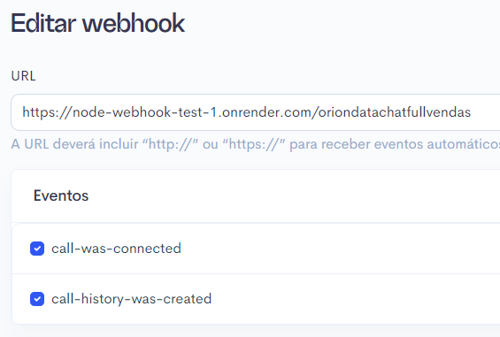
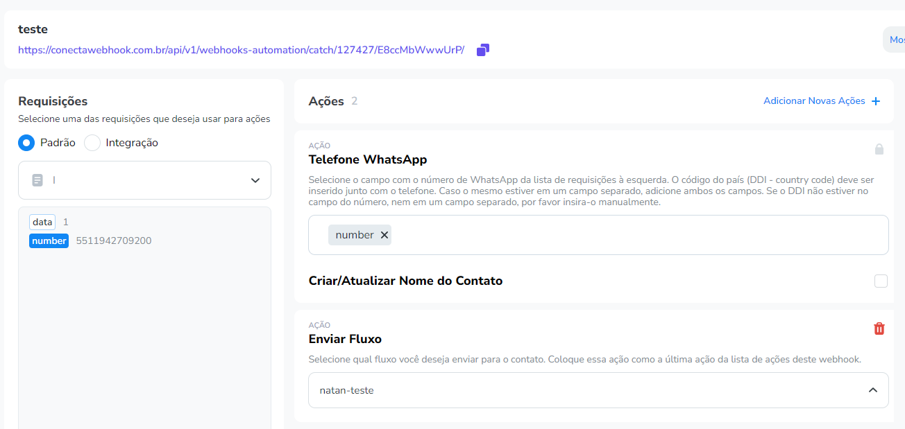

# node-webhook-test-1
Teste para integração

## 1 - Iniciando Projeto - Comandos no terminal
- `$ npm init -y`
- `$ touch index.js`
- `$ node index.js`
- `$ npm install`

## 2 - Recebendo e tratando dados 3C

- Configuramos a url que irá receber os dados da 3c via webhook.
- Neste painel inserimos o link para receber a requisição:




Exemplo de estrutura enviada pela 3C durante campanha URA:
```json
{
  "call-history-was-created": {
    "_id": "66b66d926059e900830823c3",
    "number": "5511942709200",
    "campaign": {
      "id": 135772,
      "name": "ura-test-list"
    },
    "company": {
      "id": 8458,
      "name": "NOVA ORION"
    },
    "mailing_data": {
      "_id": "66b66d55e4cd1d2cdf19dc22",
      "identifier": "1111",
      "campaign_id": 135772,
      "company_id": 8458,
      "list_id": 1675666,
      "uf": "SP",
      "phone": "5511942709200",
      "dialed_phone": 2,
      "dialed_identifier": 2,
      "on_calling": 0,
      "column_position": 2,
      "row_position": 1,
      "data": {
        "nome": "Nat1"
      }
    },
    "phone_type": "mobile",
    "agent": {
      "id": 0,
      "name": null
    },
    "route": {
      "id": 12472,
      "name": "3C Plus ITX | Ilimitado ",
      "host": "34.139.235.7:5060",
      "route": "10015",
      "endpoint": "PJSIP/3cplus_next/sip:",
      "caller_id": null
    },
    "telephony_id": "ExFtq2CSbs",
    "status": 6,
    "qualification": {
      "id": null,
      "name": null,
      "behavior": null,
      "behavior_text": null,
      "conversion": null,
      "is_dmc": 0,
      "is_unknown": 0
    },
    "billed_time": 30,
    "billed_value": 0,
    "rate_value": 0,
    "dial_code": 0,
    "amd_status": 1,
    "hangup_cause": 16,
    "recorded": true,
    "ended_by_agent": false,
    "ivr_after_call_time": 0,
    "qualification_note": "",
    "sid": "",
    "call_mode": "ura",
    "list": {
      "id": 1675666,
      "name": "3c-test.csv",
      "original_name": ""
    },
    "call_date": "2024-08-09T19:26:43.000000Z",
    "calling_time": 5,
    "waiting_time": 0,
    "speaking_time": 23,
    "amd_time": 3,
    "speaking_with_agent_time": 0,
    "acw_time": 0,
    "ivr_after_call": false,
    "criteria": null,
    "ura_time": 20,
    "ivr_digit_pressed": "2",
    "should_dispatch_webhook": true,
    "webhook_urls": {
      "1": "https://webhook.site/06353197-1ad8-4356-abb0-469d123fe3e0"
    },
    "max_time_exceeded": 0,
    "updated_at": "2024-08-09T19:27:14.194000Z",
    "created_at": "2024-08-09T19:27:14.194000Z"
  }
}
```

- Caso os dados recebidos da 3C sejam aceitáveis. Procedemos para o envio ao sistema da ZAPLUS.

- A função resposável por validar os dados é `TrataDados3C(dados3c)`:

```javascript
// Recebe  um POST de 3C
app.post('/oriondatachatfullvendas', async (req, res) => {

  // Trata o JSON
  const Dados_Ura_Json = req.body;
  const Dados_Ura_Validos = TrataDados3C(Dados_Ura_Json);

  // Se os dados forem validados
  if (Dados_Ura_Validos !== false) {
    const webhookSuccess = await EnviarZaplus(Dados_Ura_Validos);
  } 

});
```

```javascript
// Função para validar os dados
function TrataDados3C(data) {
    const { "call-history-was-created": { ivr_digit_pressed, number } } = data;

    if (Boolean(ivr_digit_pressed) && Boolean(number)) {
        return {
            number: number,
            data: ivr_digit_pressed
        };
    }

    return false;
}
```

## 3 - Enviando dados de interesse ao sistema ZAPLUS

- Após validar os dados queremos envia-los, usando a função `EnviarZaplus(data)`, ao sistema da ZAPLUS.
- Os dados de interesse são valores que cumprem certos valores de campos da estrutura naterior. A função `TrataDados3C(dados3c)` contém as regras de validação.
- Neste menu verificamos os valores recebidos do web serviço pelo ZAPLUS:




```javascript
// Função para enviar os dados ao ZAPLUS
async function EnviarZaplus(data) {
    try {
        const Zaplus_Webhook = 'https://conectawebhook.com.br/api/v1/webhooks-automation/catch/127427/E8ccMbWwwUrP/'
        const response = await axios.post(Zaplus_Webhook, data);
        return response.status === 200;
    } catch (error) {
        console.error('Erro ao enviar dados para o webhook:', error);
        return false;
    }
}
```